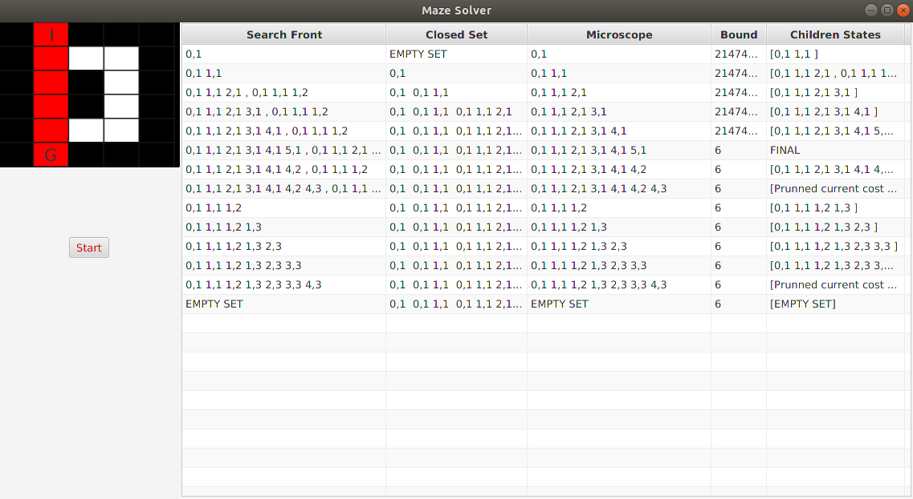

# UniMazeBnB
Optional assignment regarding the use of the Branch and Bound algorithm, in order to get the optimal path in a maze.
By changing the positions of the walls from the code it can work in any maze.
 
Letter I: The start of the maze. 
Letter G: The end of the maze.
