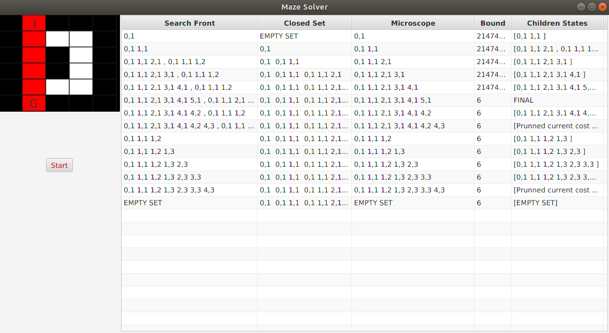

<<<<<<< HEAD
# University-Projects
=======
# UniMazeBnB
Optional assignment regarding the use of the Branch and Bound algorithm and DFS, in order to get the optimal path in a maze.
By changing the positions of the walls from the code it can work in any maze.
  Each node has the following format: row,column .
 
Letter I: The start of the maze. 
Letter G: The end of the maze.

>>>>>>> UniMazeBnB/master
